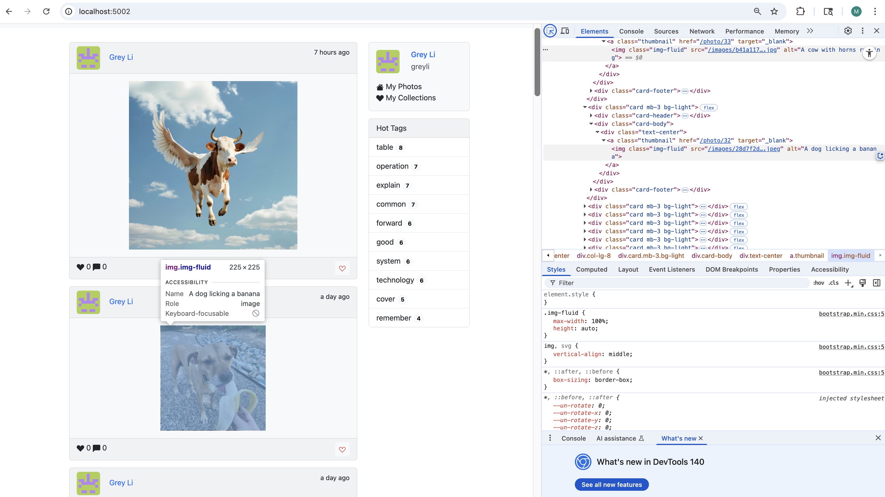

# Moments - ML-Enhanced Photo Sharing Application

This is an enhanced version of the Moments photo sharing application with machine learning-powered features for accessibility and image search.

## New ML Features

1. **Automatic Alt Text Generation**: Uses Azure Computer Vision API to generate descriptive alternative text for uploaded images
2. **Object-Based Image Search**: Allows users to search for images by detected objects (e.g., "elephant", "dog", "car")

## Demo


## Setup Instructions

### Prerequisites
- Python 3.8+
- Azure Computer Vision API credentials

### Azure Computer Vision Setup
1. Create an Azure account at [portal.azure.com](https://portal.azure.com)
2. Create a Computer Vision resource (free tier available)
3. Note your endpoint URL and API key

### Installation

1. Clone the repository:
```bash
git clone https://github.com/yourusername/CS516-HW1.git
cd CS516-HW1
```

2. Create and activate virtual environment:
```bash
python -m venv .venv
source .venv/bin/activate  # On Windows: .venv\Scripts\activate
```

3. Install dependencies:
```bash
bash run_moments.sh
```

4. Create API configuration file:
```bash
touch api_config.py
```

Add your Azure credentials to `api_config.py`:
```python
# Azure Computer Vision API credentials
AZURE_VISION_ENDPOINT = "https://your-resource-name.cognitiveservices.azure.com/"
AZURE_VISION_KEY = "your-api-key-here"
```

### Running the Application

```bash
bash run_moments.sh
```

The application will be available at `http://localhost:5002`

**Test Account:**
- Email: admin@helloflask.com
- Password: moments

### Using ML Features

1. **Upload images** at `/upload` - alt text will be automatically generated
2. **Search by objects** using the search bar or Objects category
3. **View alt text** by inspecting HTML img elements in browser developer tools

## ML Implementation Details

- **Alt text generation**: Images processed on upload with Azure Computer Vision
- **Object detection**: Detected objects stored as JSON in database
- **Combined search**: Default search includes both descriptions and detected objects
- **Fallback handling**: Graceful degradation when API is unavailable

## Security Notes

- API credentials stored in `api_config.py` (not committed to git)
- Credentials can alternatively be set as environment variables
- File uploads validated for security

## Dependencies

Key additions for ML functionality:
- `requests` - HTTP client for Azure API calls
- Azure Computer Vision API - Image analysis service
